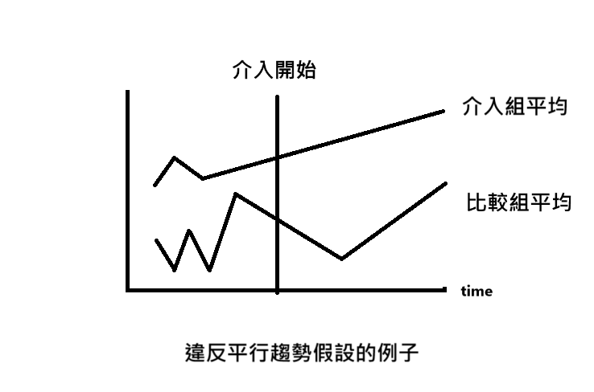

# 書籍資訊簡介

- 數據分析的力量 Google、Uber都在用的因果關係思考法
- [book information](https://www.books.com.tw/products/0010779908?srsltid=AfmBOorDKOOHvAhDoc-UL6Lm9pYDZ4_boShGDfCS74wQSbI4cGq2TkFK)

# 書籍摘要

本書介紹一些實證計量經濟學用過的分析手法與實例，包含： 隨機對照實驗 (RCT)、RD 設計(Regression Discontinuity)、堆集分析(Bunching Analysis)、縱橫資料分析等

## 隨機對照實驗 (RCT)

將實驗區分為介入組跟比較組，藉由探究兩者的介入效果(Treatment Effect)，即：有介入的組-沒有介入的組的效果

- 介入組：有受到政策/措施影響的組別

- 比較組：沒有受到政策/措施影響的組別

> 在商業領域，RCT = A/B test

### 假設

- 如果沒有介入(政策/措施的影響)，比較組的平均 $Y_C$ 會與介入組的平均 $Y_T$ 相同

### 注意點

1. 妥善建立群組

2. 一定要隨機分組

3. 各組樣本數需充足

### 優缺點

優

1. 因果關係強

2. 分析手法與結果具透明性

缺

1. 實施成本高昂

## RD 設計

- 當 RCT 無法使用時使用，可將 RD 設計想成在界線附近自然發生的 RCT。

- 利用自然實驗(= 猶如人工作出實驗的自然發生情況)分析

### 假設

- 如果 $X$ 未在界線上變動，$Y$ 就不會在界線上發生跳躍

> 實務上是個不容易證實的假設

### 注意點

- 要先找出「界線」上，僅因一種因素($X$)發生不連續變化的情況

- 需要檢驗其他因素是否也會導致 $Y$ 在界線上發生跳躍，如果會，那 RD 假設就不成立，結果解釋會不準確。

### 優缺

優：

1. 只要不違反假設就可以證實因果關係

2. 實施成本比 RCT 低廉

缺：

1. 只能測試在界線附近的人之因果關係，離界線很遠的人，需要加上其他假設，否則無法解釋

### 例子

- 南北地理界線的電價差異是否導致家庭用電量變動

## 堆集分析(Bunching Analysis)

一樣在 RCT 無法使用時使用，利用資料階梯狀的變化分析因果關係

### 假設

- 如果 $X$ 並**未**呈階梯狀變化，$Y$分布會平滑，不會在界線上堆集。

### 注意點

- 評估某個呈階梯狀變化的因素是否能用於分析

- 導致資料呈階梯狀變化的因素只有一個，沒有其他人

- 需要分析誘因大幅變化的分界點上發生的堆集，檢驗人 or 企業對誘因變化有甚麼反應/因果關係

### 例子

- 汽車越大台，油耗規定是否越寬鬆

- 所得稅的稅率是否影響工作方式

### 優缺

優：

1. 假設成立，效果便近似 RCT 

2. 分析結果易於理解

缺：

1. 只能推定分界點附近**受到呈階梯狀變化誘因影響的主體**

2. 假設更難證明成立

## 縱橫資料分析

一樣在 RCT 無法使用時使用，假設政府/企業實施某項政策/措施時，有的群組有受到影響，有的沒有，此時：

- 有受到政策/措施影響的群組為介入組

- 沒有受到影響的為比較組

此外也有這兩個群組實施前跟實施後不同時間點的資料，就可以做縱橫資料分析，求出介入組在沒有介入(實施某項政策/措施)時的可能效果，進而得出此項政策/措施的介入效果(=實際介入效果-沒有介入時的可能效果)

### 假設

平行趨勢假設：

- 如果沒有發生介入，介入組的平均結果($Y_T$)和比較組的的平均結果($Y_C$)就會平行推移

### 注意點

主張平行趨勢假設成立需要做：

- 蒐集介入發生以前的資料，調查介入發生之前平行趨勢假設是否存在介入組跟比較組之間

- 仔細檢查介入開始後，有無其他影響因素**只**影響介入組跟比較組中的其中一組

- 若平行趨勢假設成立，就將雙方的平均數推移化成圖表，測定介入效果的平均數

### 例子

- 所得稅與移民關係的因果關係

- 實施景氣刺激政策是否只會增加搶購需求

### 優缺

優：

1. 可應用範圍比 RD 設計跟堆集分析大

2. 分析結果易於理解

3. 可分析對象跟範圍比 RD 設計跟堆集分析大，可分析主體效果

缺：

1. 假設很難證明是否成立，也很難成立

# 方法論的限制

1. 若資料有問題，分析手法再好也無法解決

2. 分析結果不一定能推廣到其他群體

3. 研究者的主見(偏見)會影響資料選取的對象，進而影響結果的可靠性

4. 理論上對介入組實施介入不影響比較組，實務上可能會被推翻

# 延伸閱讀

Econ 大一 ~ 大三程度

- Introductory Econometrics： A Modern Approach , Jeffrey M. Wooldridge

Econ 大三大四程度

- Mostly Harmless Econometrics: An Empiricist's Companion, Angrist, Joshua D., Pischke, Jorn-Steffen

Econ 研究所程度

- Microeconometrics: Methods and Applications, Cameron, A. Colin, Trivedi, Pravin K

# 小心得

因為作者是實證經濟學背景，讀起來有熟悉又陌生的感覺，裡面的東西感覺也跟實驗設計有連結。不過因為書籍的內容是設計給高中生閱讀，因此只有通識程度，詳細介紹與細部的數學推導可能還需要靠延伸閱讀裡的書籍介紹。

