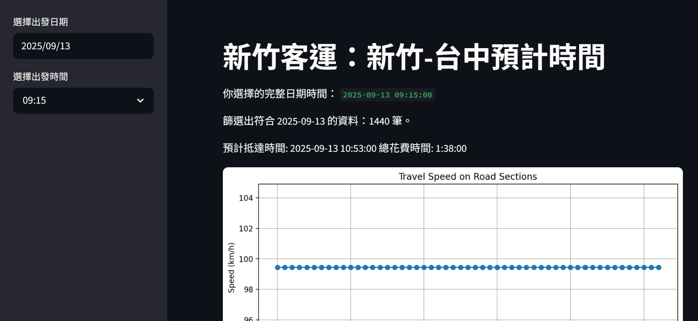
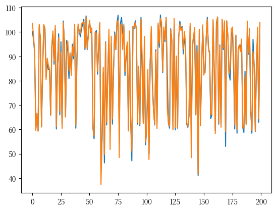
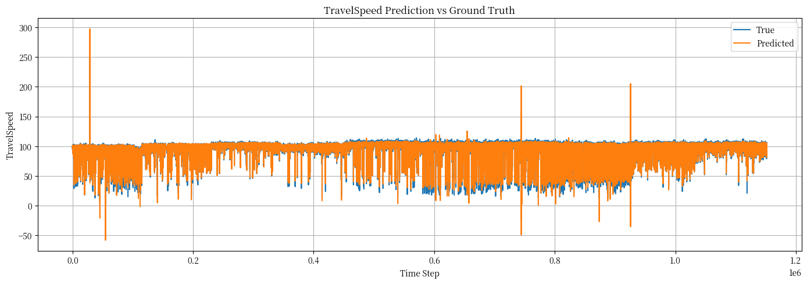

# 前言

這個 Side Project 的發想完全來自我個人生活中的需求。

以前在大學時認識了一些台中人，或是畢業後留在台中工作的人，加上在在大學生活期間我愛上在台中的生活，畢業後即使在台北工作，有空時我還是會跟朋友約一約，前一天回到新竹，隔天搭乘新竹客運跟著新竹的朋友一起跑到朝馬去找老朋友吃飯、聊天、唱歌。不過這種難得的假日聚會，住在台中的朋友總是會事先負責訂位，確保我們都有店可去。而我們呢，則是負責不要遲到XD

通常為了避免遲到，我跟朋友通常會搭早一點的客運出發。長久搭下來，主要影響客運的因素為會不會在路上塞車，經驗上來說，到台中時都會塞一小段。自從知道交通部有國道車流的開放資料後，我就想嘗試看看用國道的資料建模，看看能不能用神奇的 "占卜" ，讓我們成為時間精算師，再也不要搭這麼早的客運了！XD

# 需求架構

我的需求架構為：

- 建一個簡單的網站，當使用者輸入客運出發時間時，會顯示客運預計到達朝馬(台灣大道)的時間。

不過因為我手上只有國道的車流資料，實際客運會在市區停留靠站，所幸花費時間基本上都是固定的，所以我**只有預測客運在國道上的時間**，市區停留靠站固定設定為45分鐘。

此外，因為設備跟預算上的限制，我的預測資料是事先準備好(預測好)，再交由網站呈現。

最後做出來的東西，先用 Streamlit 套件來Demo：



~~但其實好像可以直接用HTML+CSS+JavaScripts靜態網頁的架構，因為我的模型沒有包在裡面XD~~

正式版的 demo 網址 [點此](https://sideprojectapp-hwmfunbcl8sadxbpuvte4p.streamlit.app/)

目前覺得各方面來說有很多需要改進的地方，待會來提。


# 建立過程

主要流程為：

```
下載交通部資料 → 清洗資料 → 補齊缺失資料 → 區分 training set, valid set, test set → LSTM模型建模 → 產出資料 → Web 呈現 
```

 因為這次使用的資料類型為 single time series，~~加上懶得去找其他變量的關係~~，所以完全沒有做特徵工程。

## 資料來源簡介

使用來源為交通度高公局交通資料庫的開放資料，[網址](https://tisvcloud.freeway.gov.tw/history/motc20/Section/)。

我使用的欄位有：

- SectionID 

- Travel_Speed

以及在檔名擷取時間。

我的訓練資料為 2024 年屬於國定假日範圍的資料，其中有 10 % 的資料屬於訓練階段的 valid set ， 其餘 90% 為 training set；用來測試模型的 test set 為 2025年上半年國定假日範圍的資料，期間為 1/1 ~ 8/30 。


## 清資料

主要流程為：

1. 將資料按2024年國定假日、符合新竹-台中的 Section 按 SectionID 爬下來

2. 補齊遺失值，基本使用 Cubic Spline 補齊遺失值，如果補出來的資料太不合理，例如嚴重超過速限，則考慮那一天的資料都移除。所幸只有228那天有問題，只移除這一天。

3. 最後用敘事性統計觀察資料有無異常。


## 訓練資料

流程：

1. 區分 training set, valid set，test set 為2025上半年的資料。

2. 訓練模型

3. 計算valid set RMSE、畫圖觀察

4. 確認OK後，拿 test set 試試

5. 計算test set RMSE、畫圖觀察

確認都可以後再依 section 產出預測資料。

### 指定 LSTM 的原因

~~因為我想玩還有我很懶~~，原先在指定 LSTM 之前，有先考慮過使用 ARIMA 或是 SARIMA 模型來進行預測，不過指定這種經典的統計模型的缺點是滿吃對資料的觀察能力，我太菜了，沒有人在旁邊指導我撞牆可能會撞很久。此外，一直以來有耳聞過 LSTM 的用於 series data 的強大，也有看過一些與其他模型的預測能力比較的論文，[像是這篇](https://ieeexplore.ieee.org/abstract/document/9691669/)。

神經網路家族的模型雖然複雜，但沒有特殊的統計假設；而且 LSTM 模型適合預測沒有突發事件影響的資料，我的資料搜查範圍僅限假日，基本上沒有突發事件影響。因此考慮後決定用 LSTM 模型來進行預測。

### 模型架構

試了好幾個參數後，得出的最好的模型架構與效果為

```python
class LSTMModel(nn.Module):
    def __init__(self, input_size=4, hidden_layer_size=16, output_size=1, num_layers=1):
        super().__init__()
        self.hidden_layer_size = hidden_layer_size
        self.num_layers = num_layers

        self.lstm = nn.LSTM(input_size, hidden_layer_size, num_layers, batch_first=True)
        self.linear = nn.Linear(hidden_layer_size, output_size)

    def forward(self, input_seq):
        batch_size = input_seq.size(0)
        h0 = torch.zeros(self.num_layers, batch_size, self.hidden_layer_size).to(input_seq.device)
        c0 = torch.zeros(self.num_layers, batch_size, self.hidden_layer_size).to(input_seq.device)

        lstm_out, _ = self.lstm(input_seq, (h0, c0))
        out = self.linear(lstm_out[:, -1, :])
        return out
```

### 模型參數設定

基本參數為

```python
# 訓練參數
seq_length = 15
predict_step = 15 #一次預測15分鐘
epochs = 30
patience = 5 # early stop
# Early stopping at epoch 12.
```

最終設定的 LSTM 模型指定參數為

```
LSTMModel(
  (lstm): LSTM(4, 16, batch_first=True)
  (linear): Linear(in_features=16, out_features=1, bias=True)
)
```

```python
device = torch.device('cuda' if torch.cuda.is_available() else 'cpu')
model = LSTMModel().to(device)
loss_function = nn.MSELoss()
optimizer = torch.optim.Adam(model.parameters(), lr=0.001)
```

### 相關訓練數據

RMSE 部分：

| set| RMSE|
|--- | --- |
|valid set | 3.0401| 
|test set | 6.0785 |


▲ valid set 前 200 筆真實值(藍線)跟預測值(橘線)觀察圖



▲ test set 真實值(藍線)跟預測值(橘線)觀察圖，可以看到除了部分超過速限的資料外，整體還行。

無論是 valid set 還是 test set 的 RMSE 跟繪圖結果，看起來都相當不錯，但實際執行預測下半年的資料後，還是覺得有些問題。

# 需要改進的地方

## 模型預測部分

雖然 LSTM 模型的表現從數據看起來相當不錯，不過實際預測結果的 TravelSpeed 卻經常保持在平穩的線上，這跟我實際搭車的經驗不太符合，細想後我認為有 2 個原因：

1. TravelSpeed 的定義跟搭乘客運的時速沒有關係

2. LSTM 模型適合預測沒有遭遇突發重大變化的資料，反過來說當沒有太大變化的資料時間步細分成數分鐘時，LSTM 模型的預測也不會有太大的變化

其中 1. 可能是主要原因，只能說搞清楚資料定義真的真的很重要QQ

## UIUX 設計

目前將資料部署在 streamlit 平台上，雖然有不用切換程式語言、使用語言直觀簡潔、不用自己重新設計 UIUX 等優點，但實際部署後網路載入速度實在是太慢了，而且也沒有 RWD 設計。再來是日期及時間表單的選擇，原先我希望能顯示只有我已經預測好的時間區間，但實際發現他的日期跟時間套件沒有這樣選，如果要做到我要的效果，可能需要從現有的 streamlit 輸入元件指令中找一個最符合我想像的，再轉換資料型別成 date time 格式以利後續處理資料。

